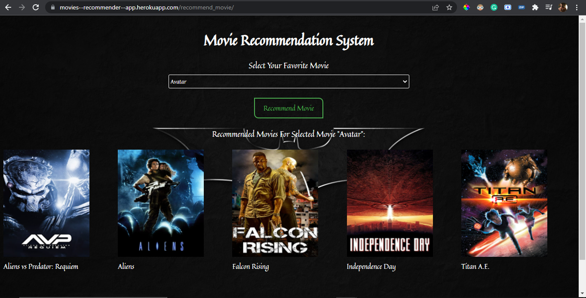

# Movie Recommendation Web App Using Django

## Download Model
Download model from following link and put it into same place where movies.pkl file is present.<br>
<a href='https://drive.google.com/file/d/13yPmjQ-gYBC9I16wnDIFBqFdZwnx3Bj_/view?usp=sharing' alt='Download Model'>Download Model</a>

## Website Link
Check out website deployed on heroku. Click on the following link to check out website:<br>
<a href='https://movies--recommender--app.herokuapp.com/' alt='Website Link'>https://movies--recommender--app.herokuapp.com/</a>

## Screenshot
<table>
    <thead>
        <tr>
            <th>Home Page</th>
        </tr>
    </thead>
    <tbody>
        <tr>
            <td></td>
        </tr>
    </tbody>
</table>

## Python Django & NLP
- Used Python Django Framework for developing Web Application.
- Used NLP(Natural Language Processing) with Python for creating model.

## Deployed On Heroku
- Deployed Django Web App on Heroku.
- Add Procfile. Also install waitress and whitenoise library.
- Update some configration in <i>settings.py</i> file. 
- Steps to deploy Web App on Heroku:
```powershell
heroku login
heroku create <app-name>
heroku git:remote -a <app-name>
git add .
git commit -m "Commit Message"
git push heroku master
```

## Tools
- Python
- Django
- Machine Learning
- NLP